<!-- Header & project cards are animated SVGs in /assets — regenerate with: python .github/scripts/build_assets.py -->

  
  
  
  

 

## About

I'm a **full-stack developer from India 🇮🇳** who builds fast, polished web products end-to-end — interfaces in **React, Next.js & TypeScript**, and APIs, auth and data in **Python, Django & MySQL**.

<table>
  <tr>
    <td width="33%" valign="top">
      <b>🎨 Frontend</b> 
      Responsive, animated UIs with React, Next.js, Tailwind & Framer Motion.
    </td>
    <td width="33%" valign="top">
      <b>⚙️ Backend</b> 
      REST APIs, auth, memberships & admin panels with Django and MySQL.
    </td>
    <td width="33%" valign="top">
      <b>🚀 Shipping</b> 
      Production deploys on Vercel & VPS, performance and SEO tuning.
    </td>
  </tr>
</table>

- 🔭 &nbsp;**Now:** building SaaS-style booking platforms with Next.js + Django REST
- 🌱 &nbsp;**Learning:** advanced React & Django patterns, MySQL query optimization
- 🤝 &nbsp;**Open to:** freelance projects, collaborations and full-time roles

 

## Tech Stack

   
  

 

## Featured Projects

  
  
  
  
  
  

Click any card to open the live site or source code.

  
<b>More projects & client websites</b>

   

| Project | What it is | Stack | Links |
|---|---|---|---|
| 🧩 **Library API** | Standalone Django REST backend (accounts, seats, memberships, complaints) | `Django` `Python` | [Code](https://github.com/boxerdinesh88-png/backend) |
| 🅿️ **Parking Web** | Parking management website | `HTML` `CSS` `JS` | [Live ↗](https://boxerdinesh88-png.github.io/parking-web/) · [Code](https://github.com/boxerdinesh88-png/parking-web) |
| 🏋️ **Gym** | Fitness studio landing page | `HTML` `CSS` `JS` | [Live ↗](https://boxerdinesh88-png.github.io/gym/) · [Code](https://github.com/boxerdinesh88-png/gym) |
| 🚗 **Car Website** | Automotive showcase site | `HTML` `CSS` `JS` | [Live ↗](https://boxerdinesh88-png.github.io/car-website/) · [Code](https://github.com/boxerdinesh88-png/car-website) |
| 🍽️ **Mexent Food** | Hotel & restaurant menu site | `HTML` `CSS` `JS` | [Live ↗](https://boxerdinesh88-png.github.io/mexentfood/) · [Code](https://github.com/boxerdinesh88-png/mexentfood) |
| 💄 **Makeup Forever** | Beauty brand website | `HTML` `CSS` `JS` | [Live ↗](https://boxerdinesh88-png.github.io/makeupforever/) · [Code](https://github.com/boxerdinesh88-png/makeupforever) |
| 🌱 **Fungro** | Business website | `HTML` `CSS` `JS` | [Live ↗](https://boxerdinesh88-png.github.io/Fungro-/) · [Code](https://github.com/boxerdinesh88-png/Fungro-) |
| 🗂️ **Portfolio v1** | My first portfolio | `HTML` `CSS` `JS` | [Live ↗](https://boxerdinesh88-png.github.io/portfolio-/) · [Code](https://github.com/boxerdinesh88-png/portfolio-) |

 

## GitHub Activity

  

  <picture>
    <source media="(prefers-color-scheme: dark)" srcset="https://raw.githubusercontent.com/boxerdinesh88-png/boxerdinesh88-png/output/snake-dark.svg" />
    <source media="(prefers-color-scheme: light)" srcset="https://raw.githubusercontent.com/boxerdinesh88-png/boxerdinesh88-png/output/snake.svg" />
    
  </picture>

 

## Let's Build Something

Have a project in mind or a role that fits? I usually reply within a day.

  
  
  

  

